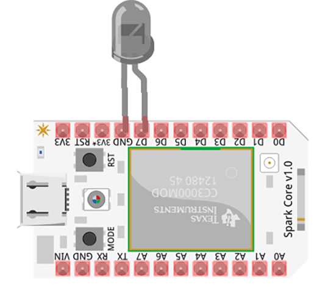
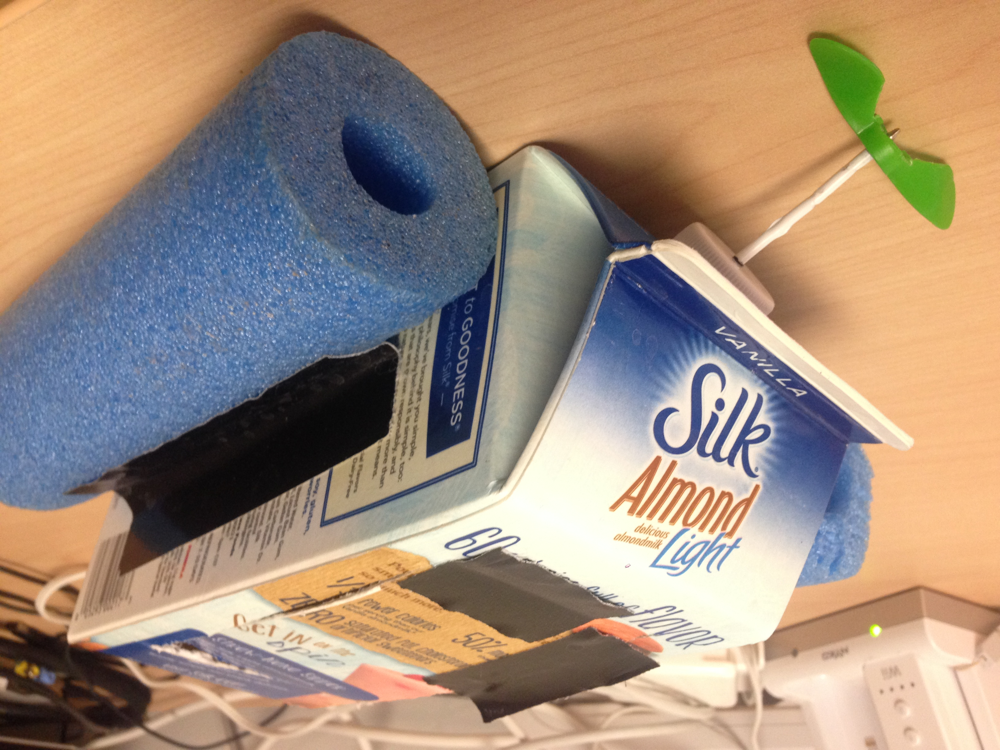
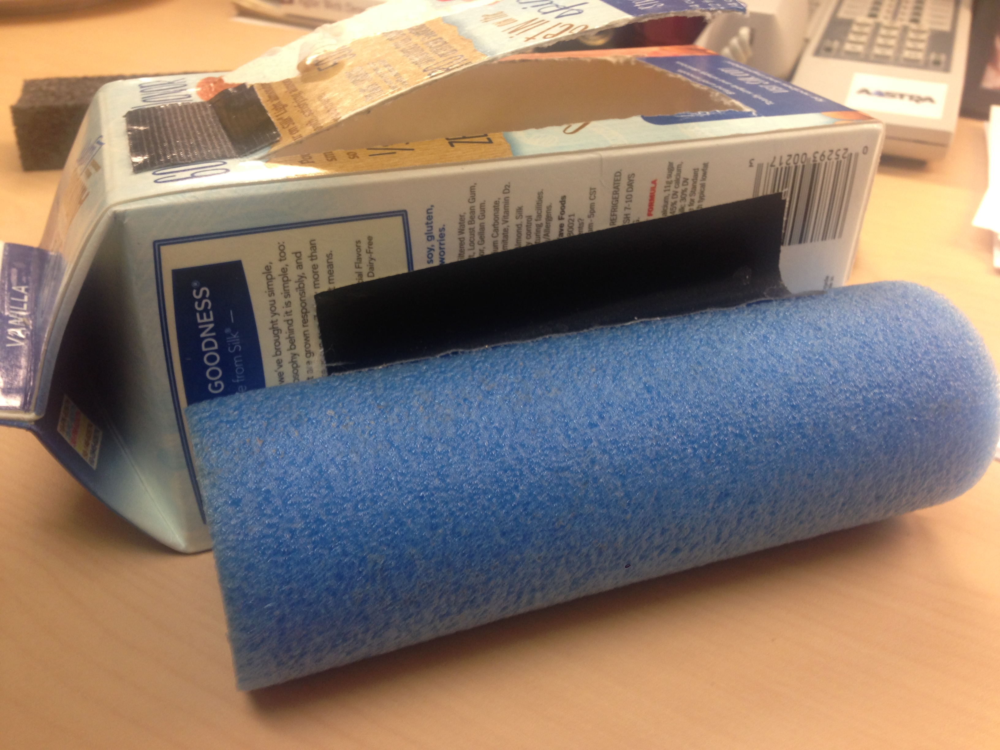
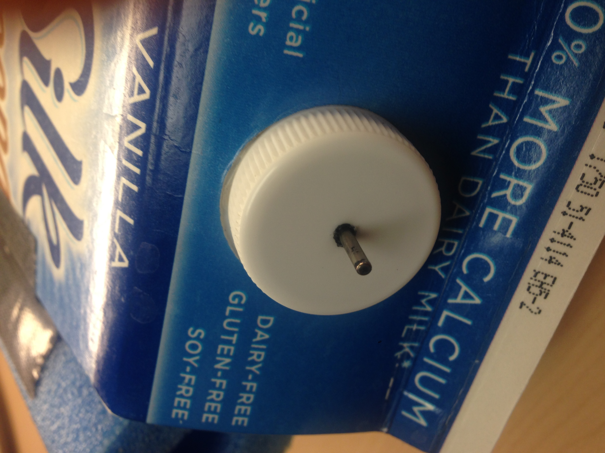
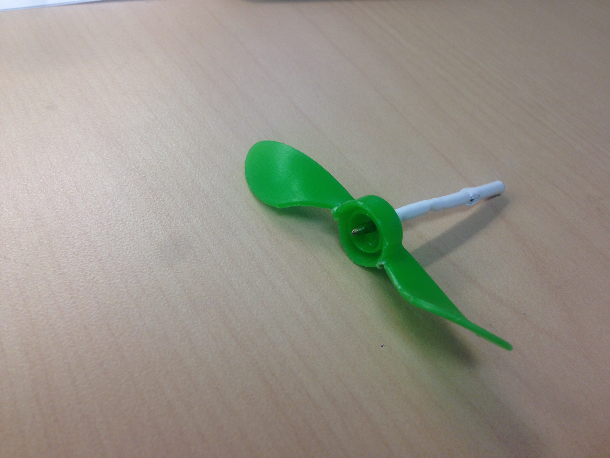
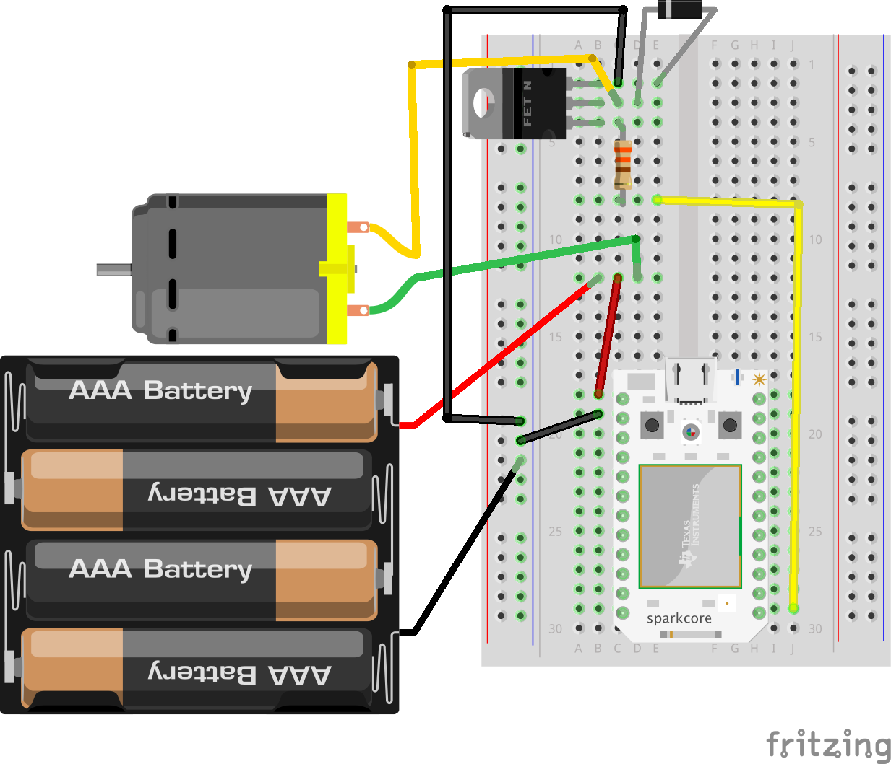

# Welcome to Nodeboats!
Before constructing the nodeboat, there is a wiring exercise to help you get familiar using the particle device.

## Code
All the code is located on github at [https://github.com/blackjk3/nodebotsday](https://github.com/blackjk3/nodebotsday).  If you are uncomfortatble using git, you can download the zip file [here]().  After you have obtained the code, in a command prompt navigate to the nodebotsday folder and run the following commands.

```bash
$ npm install --save johnny-five
$ npm install --save particle-io
```

## Motors

The dc motors in your kit are a standard hobby motor.  The motor draws too much current for our little particle to handle on it's own, so we will need to setup a transistor to amplify the power.

# Example 1 - Blink an LED
To get started we are going to setup an led and make it blink.  Hook up the led to the breadboard like below.  The long end goes into D7 and the short end goes to GND.


Now that the circuit is setup, open the start-led.js JavaScript file. In order to establish a connection to the board, you will in the file you will need to replace "process.env.SPARK_DEVICE_ID" with the device_id obtained earlier.  You will also need to replace "process.env.SPARK_TOKEN" with the access_token which is written on the whiteboard.

```bash
deviceId: 'MY_DEVICE_ID', // This is the device_id for YOUR specific particle
token: 'ACCESS_TOKEN_FROM_BOARD' // This should be on the board as "access_token"
```

To run the example navigate to the "1-start-led" folder in a command prompt and type

```bash
$ node start-led
```

Congratulations, you have ran your first example!

# Construction
The boats take more work to construct than the bots, so we should get to work!



## 1 - Pick out your boat
There are various objects that you can use to construct your boat.  The easiest will be the milk carton, however if you are more ambitious you can use anything that is waterproof and will float.

## 2 - Cut a hole in the top of the boat
You will need to cut a hole big enough to house the electronics.  Make sure the cap is facing down when you cut the top.


## 3 - Add foam wings to your boat
In order to keep your boat from tipping, you will need some foam on each side for stability.  It is easiest to tape the foam to the body of the boat.



## 4 - Drill a small hole in the cap
Drill a small hole in the cap that is JUST big enough to fit the motor shaft.  If you cut it too big, water will come in to your boat.



## 5 - Plumbers putty
Smush a layer of plumbers putty into the inside of the cap covering the hole.  It's not perfect, but it will help to waterproof the motor.

## 6 - Propeller
The propeller is a combination of a pen shaft and a kids applesauce top.  Drill a SMALL hole in the top of the applesauce top which is JUST big enough to fit onto the top of a pen shaft.  Cut the pen shaft to about an inch and a half and attach the propeller to the shaft.  Curve the top wings in opposite directions to give it a propeller look.



## 7 - Wire up the circuit
This circuit will require several components.  In your bag should be a transistor, resistor, and a diode.  When used in combination they will help to amplify the current to our motor and keep our particle safe from overloading.

**NOTE!!!!: Please make sure the diode is in the right way.  The white stripe should be connected to the middle pin on the transistor.  Also make sure the transistor is facing towards the middle of the breadboard.**



Once your circuit is wired up, you should see the particle turn on and eventually connect to the wifi.  To test the motor run the code file below.

```bash
$ node boat-motor
```

The motor should spin for 4 seconds and then shut off.  Now that you have confirmed the motor works, time to finish up the boat!

## 8 - Finalize the boat
Disconnect motor and battery from the circuit. Push the motor tip into the hole in the cap. Screw on cap and use duct tape to secure motor to the inside of the milk carton. Once the motor is secure, push the pen shaft onto the end of the motor tip.

Wire up the motor and battery pack and run the final example.  Spacebar will turn off the motor, and the up arrow will turn it on again.

```bash
$ node boat-motor-final
```


