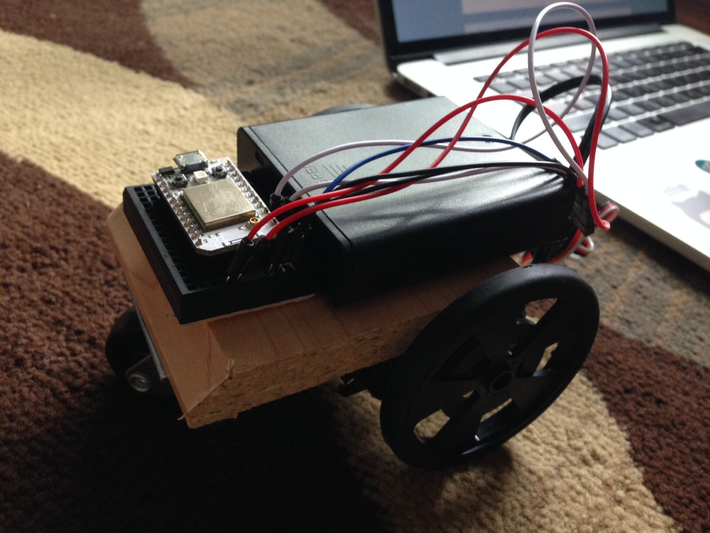

# Welcome to Nodebots!
Before constructing the nodebot, there are three wiring exercises to help you get familiar using servo motors and the particle device.

## Code
All the code is located on github at [https://github.com/blackjk3/nodebotsday](https://github.com/blackjk3/nodebotsday).  If you are uncomfortatble using git, you can download the zip file [here]().

## Motors

The motors in your kit are a special kind of servo called "continuously rotating servos".  Unlike standard servos, these servos are meant to spin 360 degrees.  They can also be powered directly without the need for an external transistor to amplify the voltage.

## Example 1 - One motor
To begin the first example, navigate to the bots folder and then into the "1-start-one-motor" folder.  In this example we are going to wire up one motor to the particle.  A diagram of the final circuit is below.  From the servo, the white wire is connected to the D0 pin, the red wire is connected to the VIN pin, and the black wire is connected to GND (ground).


Now that the circuit is setup, open the bot-start.js JavaScript file.  Feel free to take a look at the comments to get an idea of what the code is doing.  In order to establish a connection to the board, you will in the file you will need to replace "process.env.SPARK_DEVICE_ID" with the device_id obtained earlier.  You will also need to replace "process.env.SPARK_TOKEN" with the access_token which is written on the board.

```bash
deviceId: 'MY_DEVICE_ID', // This is the device_id for YOUR specific particle
token: 'ACCESS_TOKEN_FROM_BOARD' // This should be on the board as "access_token"
```

Once the deviceId and token are replaced, plug in your particle and run the following command from within the nodebotsday/bots/1-start-one-motor folder.

```bash
$ node bot-start
```
You should see the the output below, and your motor should be spinning! :)  If you have any issues, feel free to find someone to help assist you.

```bash
 Device(s) spark-io
 Connected spark-io
 Repl Initialized
>> Welcome to Nodebots Day! *************************************
You should have a simple motor that rotates forever.
```

## Example 2 - Two motors
In the next example, we are going to hook up both motors to the particle and get them spinning.  Navigate to the "2-two-motors" example in the bots folder.  Wire up the motors based on the diagram below.


Once the circuit is wired up, you can open the JavaScript file "bot-two-motors.js".  Once again, you will need to update the deviceId and token within the file.  You can now run the example from within the nodebotsday/bots/2-two-motors folder.

```bash
$ node bot-two-motors
```

## Example 2 - Two motors w/ battery
Now that we have two motors working, we can power the whole setup using 4 X AA batteries.  Add the battery pack like the diagram below.


The code from the previous example should still work.  If so, congratulations! The wiring for your bot is complete.  Remove the battery pack for now and move on to the construction portion.

# Bot Construction


## Step 1 - Drill holes for motors
Within the kit you received, there should be a block of wood like the photo above. Line up the motors along the back edge and then mark a hole in front of each motor.  Drill a small hole through the wood that will fit a zip tie through it.  For added stability, try to keep the motors as close together as possible.  Also, make sure they are both pointing the same way :)

## Step 2 - Zip tie motors
Now thread the zip tie through and secure each motor.


## Step 3 - Screw on caster wheel
Fasten the caster wheel using two small screws to the back holes.


## Step 4 - Secure breadboard and battery pack